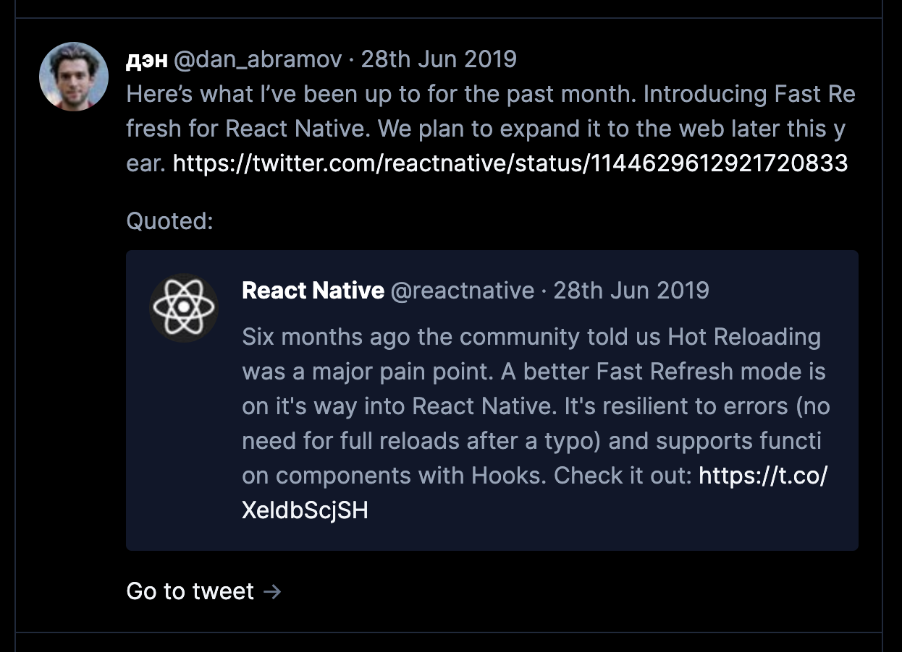

Script for downloading Twitter likes with viewer app. Includes optional script to download images locally.



## Install

### Set up Twitter Developer Account

- Go to [Developer portal](https://developer.twitter.com/en/portal/projects/) and set up account if needed. Create a project etc. Generate access tokens. Copy all received tokens.

### Create `.env` file

```bash
mv .env.template .env
```

You can find your `TWITTER_USER_ID` for example using [TweeterID](https://tweeterid.com/) service.

`API Key` is `TWITTER_CONSUMER_KEY`.

`API Key Secret` is `TWITTER_CONSUMER_SECRET`.

`Bearer Token` is `TWITTER_BEARER_TOKEN`.

### Download repository

```bash
git clone git@github.com:tchayen/backup-likes.git
cd backup-likes
mkdir likes
yarn
```

### Fetch data

```bash
node src/likes.mjs # Download liked tweets.
node src/downloadImages.mjs # Download images locally.
```

### Install deps of viewer app

```bash
cd viewer
yarn
```

## Run

```bash
yarn dev
```

Go to [localhost:3000](http://localhost:3000).

## TODO

- [ ] Fetch videos locally.
- [ ] Find a way to seemlessly fetch new liked tweets without redownloading the whole archive (might require some normalization of tweets, maybe in the end storing them in a local SQLite database).
